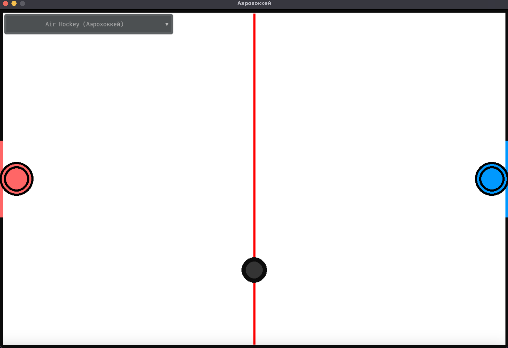
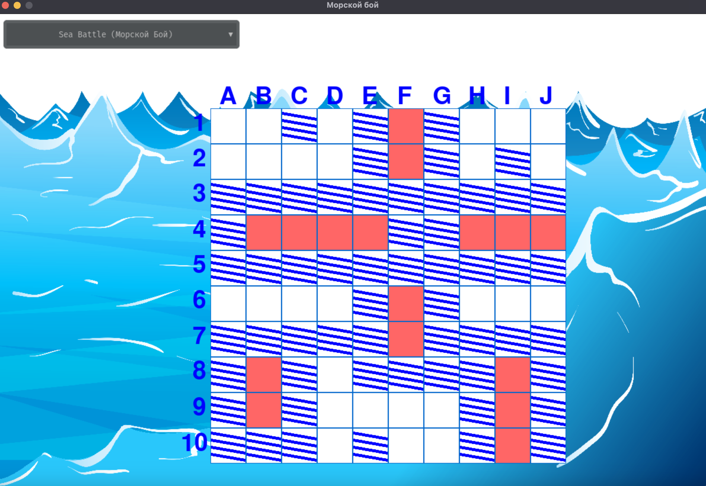
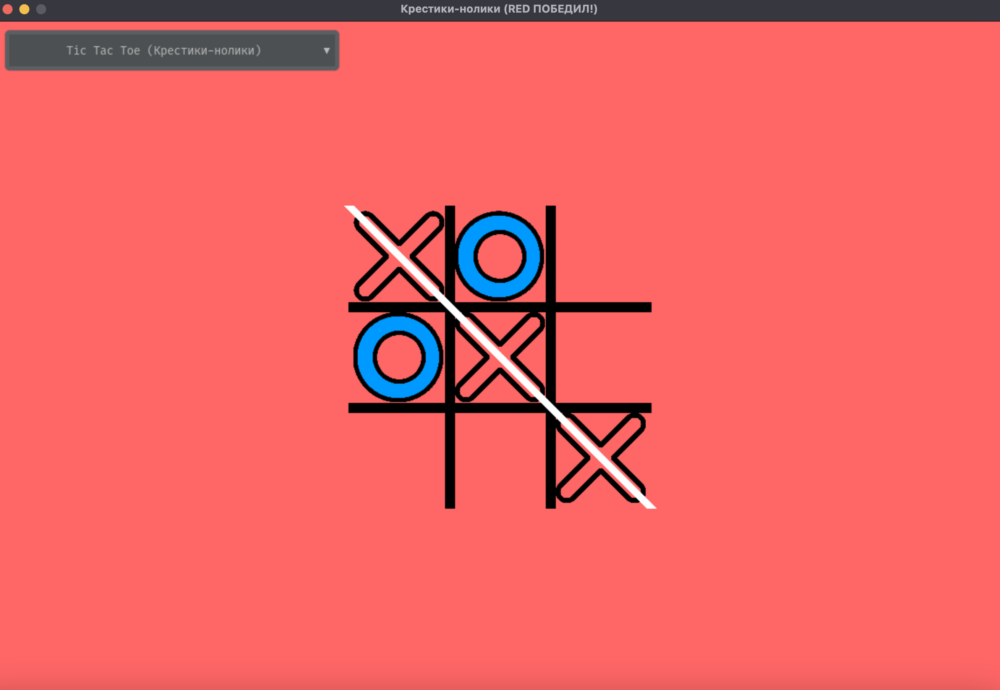

# MiniGames
Проект включает в себя 3 игры для двух игроков на одном экране: аэрохоккей, морской бой, крестики-нолики.
## Требования для игры:

1. Создать виртуальную среду, используя
    ```
    python3 -m venv venv
   ```
2. Установить pygame, используя pip:
    ```
    pip install pygame
    ```
3. Установить pygame-gui, используя pip:
    ```
    pip install pygame-gui
    ```

## Как запускать игру:

1. Клонируйте этот репозиторий, набрав в командной строке:

   https://github.com/Minaskir/MiniGames.git

2. Запустите игру:
    ```
   py main.py
    ```
# Демонстрация

1. Аэрохоккей

   

2. Морской бой



3. Крестики-нолики

